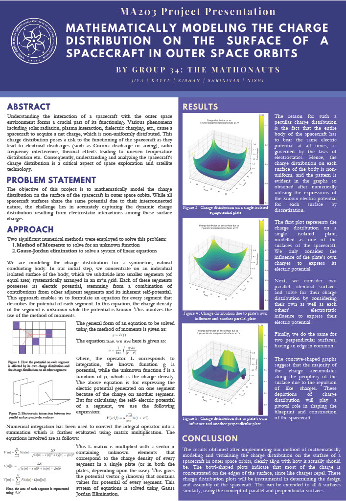

# Spacecraft-Charge-Distribution-Modelling
This project involves mathematically modelling the charge distribution on the surface of a spacecraft in outer space orbits.
## Problem Statement
Understanding the interaction of a spacecraft with the outer space environment forms a
crucial part of its functioning. Various phenomena including solar radiation, plasma interaction, dielectric charging, etc, cause a spacecraft to acquire a net charge, which is
non-uniformly distributed. This charge distribution poses a risk to the functioning of the
spacecraft. Unevenly distributed charge on a spacecraft’s surface can potentially be harmful
for several reasons including: Radio frequency interference, Surface charging, Electrostatic forces, Thermal effects etc.

It is therefore necessary to study and quantify the charge distribution on the surface of the
spacecraft in a mathematical way.

The goal of this project is to mathematically model the charge distribution on the surface of the spacecraft in outer space orbits. For the sake of simplicity as well as relevance
to current applications, we have chosen a spacecraft modeled on CUBESAT to study the charge distribution profile of its body. We are considering the body of the spacecraft to be a symmetric metallic cube, with a specified edge length. This helps us to focus more on the methodology of arriving at our result by simplifying the object under consideration.

## Poster
Given below is the image of our poster. For better clarity, please access this pdf file. [Poster PDF](https://github.com/Kishan-Ved/Spacecraft-Charge-Distribution-Modelling/blob/main/Math%20Final%20Poster_Group34%20(1).pdf)

The electric potential on the spacecraft body has only small local variations, so it is generally
considered constant. This potential is considered as 1V (this value does not matter as
we want to find the relative charge density at different points). Since the body of the
spacecraft is equipotential at all times, and we need to devise equations for finding the
potential at every point in terms of the unknown charge density ρ. Equations for finding
the charge density are made using the method of moments. Following this, we will get ‘N’
equations in ‘N’ distinct variables, which can then be solved using numerical methods like
Gaussian elimination, Gauss-Jordan algorithm, TDMA or others of this kind, depending on
the equations obtained after performing the above-mentioned steps.

## Acknowledgement
We (the group involved in making of this project) extend our heartfelt gratitude to Dr. Soumyabrata Chakrabarty (scientist - ISRO SAC, professor - IITGN) for providing the
problem statement and invaluable guidance that shaped our group project. His expertise
and continuous support were instrumental in defining the project’s direction and scope.
